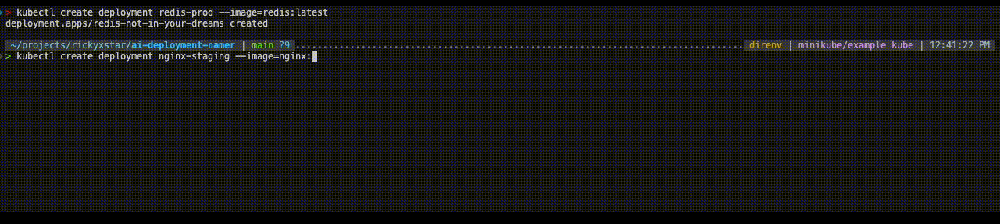

# AI Deployment Renamer Controller

Welcome to the AI Deployment Renamer Controller, the most unhelpful Kubernetes controller you'll ever deploy! Instead of improving your cluster's management, this controller leverages cutting-edge AI technology to rename your Kubernetes deployments to confusing, irrelevant, or downright absurd names. If you've ever wanted to make troubleshooting more "interesting," this is the tool for you.

# Why

Naming things is hard!

But it doesn't have to be. With advisement in artificial inelegance we now have the ability to pawn off this dirty work to the computers!

# How It Works

The controller watches all Deployment resources in your cluster.

- Upon detecting a new deployment, it generates a random name using AI-powered nonsense logic.
- It renames the deployment using a mutating admission webhook, ensuring no trace of the original, helpful name remains.
- An angel gets its wings.

# Limitations

- May cause confusion for your entire team.
- Could not configure ollama to return joke deployment names fast enough. Had to resort to expensive ChatGPT.

# Disclaimer

This project is a joke. Do not use it in production unless you really enjoy chaos. The maintainers are not responsible for any lost productivity, broken deployments, or annoyed team members.

# License

This project is licensed under the MIT License. Have fun!
